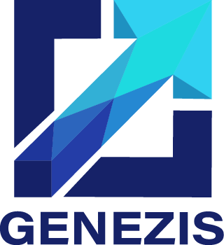

# Genezis-Repo-Cuarto-Semestre

<h3>¡Bienvenido! Este repositorio centraliza toda la ejercitación, el código y la gestión de nuestro Cuarto y ÚLTIMO Semestre de la Tecnicatura en Programación.</h3>

 

<h2>Grupo GENEZIS - COHORTE 2024</h2>

  <strong>Integrantes:</strong>
   
  Brisa Salvatierra | Javier Quiroga | Fernando Alma | Gabriel Garino
   
  Marcos Rodriguez | Luciano Cortez | Nicolás Fernández

---

## 🛠️ Gestión y Seguimiento del Proyecto

Este repositorio utiliza las herramientas de GitHub para una gestión profesional del trabajo. Puedes seguir el progreso y la organización del proyecto a través de los siguientes enlaces:

*   **[Issues (Tareas)](https://github.com/PowerSystem2024/Genezis-Repo-Cuarto-Semestre/issues):** Aquí encontrarás la lista completa de todas las tareas planificadas para el semestre, separadas individualmente.
*   **[Projects (Tablero Kanban)](https://github.com/PowerSystem2024/Genezis-Repo-Cuarto-Semestre/projects):** Un tablero visual para seguir el flujo de trabajo de las tareas desde "Por Hacer" hasta "Finalizado".
*   **[Wiki (Documentación)](https://github.com/PowerSystem2024/Genezis-Repo-Cuarto-Semestre/wiki):** El espacio central para guías, tutoriales y documentación detallada del proyecto.
*   **[Milestones (Objetivos)](https://github.com/PowerSystem2024/Genezis-Repo-Cuarto-Semestre/milestones):** Los dos grandes objetivos del semestre, con sus fechas de entrega y barras de progreso.
*   **[Releases (Versiones)](https://github.com/PowerSystem2024/Genezis-Repo-Cuarto-Semestre/releases):** Las versiones oficiales del proyecto que marcan los hitos importantes, como la configuración inicial y las entregas parciales.

---

## 🌟 Estructura del Repositorio

El código de este proyecto está organizado en carpetas principales según la **tecnología o lenguaje de programación**. Dentro de cada una de estas carpetas, encontrarás los archivos correspondientes a las diferentes clases donde se utilizó dicha tecnología.

Las carpetas principales son:
- **/AreaDeJuegos/**
- **/Java/**
- **/JavaScript/**
- **/Node/**
- **/Python/**

---

## 🗓️ Planificación Completa del Semestre

A continuación se detalla el contenido planificado para cada clase, agrupado por los objetivos de entrega.

### **Primer Avance (Clases 1-7)**

*   **Clase 1:** Laboratorio Python, E-commerce (Parte 1), Instalación de Node, Diseño 1, Sistema Estudiantes (Parte 3), Juego Avatar (Parte 1).
*   **Clase 2:** Sistemas Numéricos en Python, E-commerce (Parte 2), Node Básico, Diseño 2, Sistema Estudiantes con Spring Boot (Parte 1), Juego Avatar (Parte 2).
*   **Clase 3:** Strings en Python, E-commerce (Parte 3), Ejecución de Node, Diseño 3, Sistema Estudiantes con Spring Boot (Parte 2), Juego Avatar (Parte 3).
*   **Clase 4:** Entorno Profesional en Python, E-commerce (Parte 4), Teoría de Node, Diseño (Estudio), Sistema Estudiantes con Spring Boot (Parte 3), Juego Avatar (Parte 4).
*   **Clase 5:** Stack PERN (Parte 1), Node Síncrono, Diseño (Cuestionario), Sistema Estudiantes con Spring Boot (Parte 4), Juego Avatar (Parte 5).
*   **Clase 6:** Profundizando en Strings (Python), Stack PERN (Parte 2), Variables de Entorno en Node, Tienda de Libros con Spring Boot y Swing (Parte 1), Juego Avatar (Parte 6).
*   **Clase 7:** Pygame (Parte 1), Stack PERN (Parte 3), Herramientas de Desarrollo en Node, Tienda de Libros (Parte 2), Juego Avatar (Parte 7).

### **Entrega Final (Clases 8-13)**

*   **Clase 8:** Pygame (Parte 2), Stack PERN (Parte 4), Callbacks en Node, Tienda de Libros (Parte 3), Juego Avatar (Parte 8).
*   **Clase 9:** Pygame (Parte 3), Stack PERN (Parte 5), Callback Hell en Node, Tienda de Libros (Parte 4), Juego Avatar (Parte 9).
*   **Clase 10:** Entorno Profesional (Python), Stack PERN (Parte 6), Promesas en Node, Tienda de Libros (Parte 5), Juego Avatar (Parte 10).
*   **Clase 11:** Stack PERN (Parte 7), Async/Await en Node, Aplicación con Spring Boot (Parte 1), Cuestionario Java, Juego Avatar (Parte 11).
*   **Clase 12:** Proyecto Bomba (Parte 1), Módulos Globales en Node, Aplicación con Spring Boot (Parte 2), Juego Avatar (Parte 12).
*   **Clase 13:** Cuestionario Python, Proyecto Bomba (Parte 2), Módulos File System en Node, Aplicación con Spring Boot (Parte 3), Juego Avatar (Parte 13).
